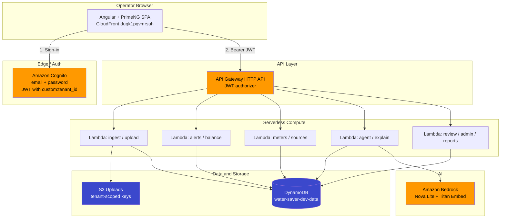
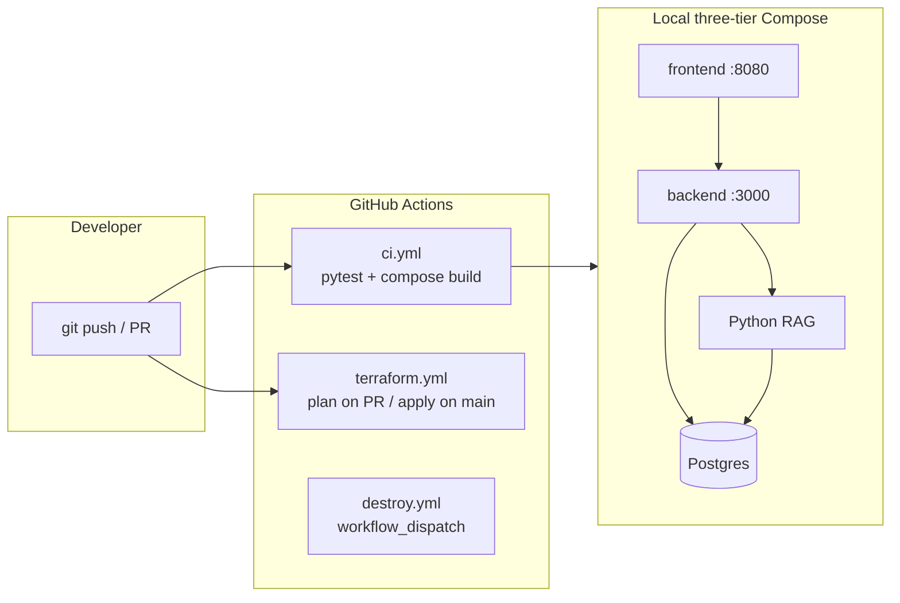
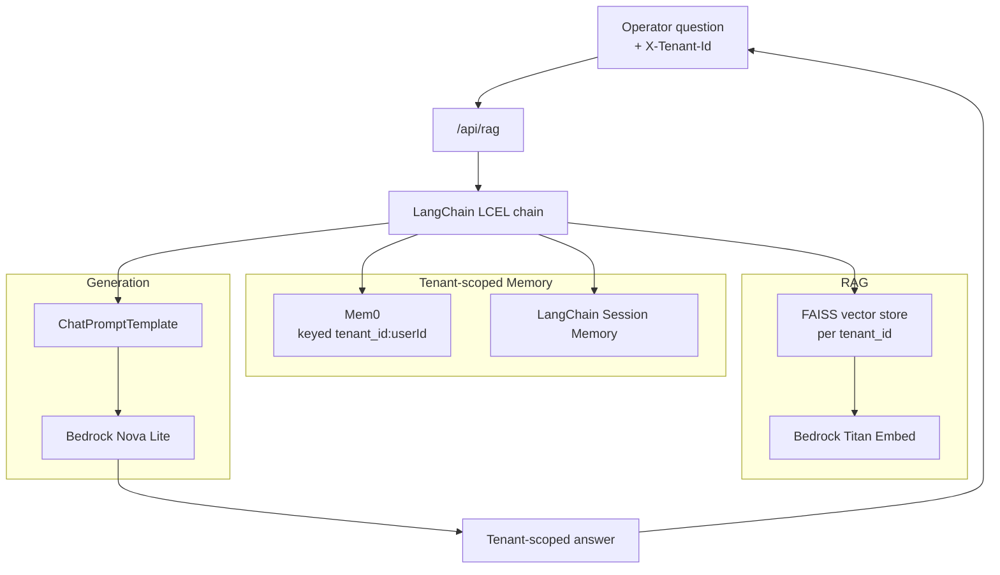
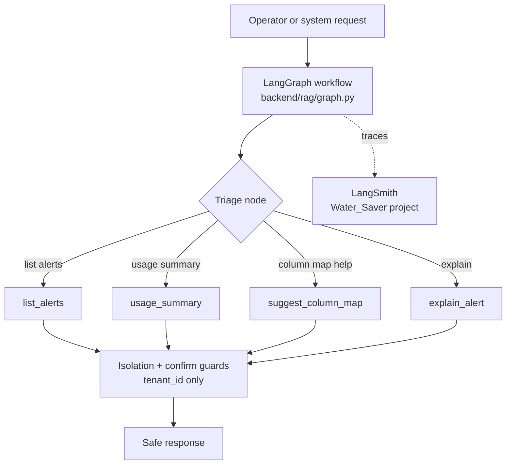
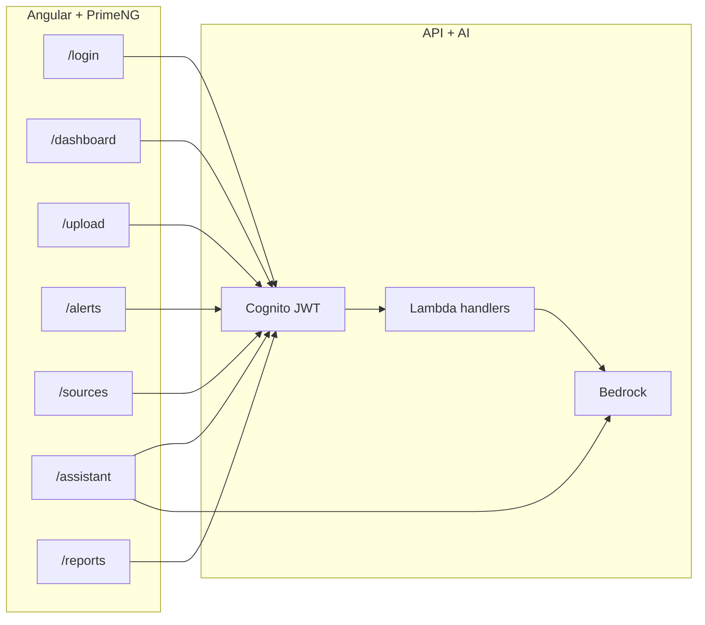
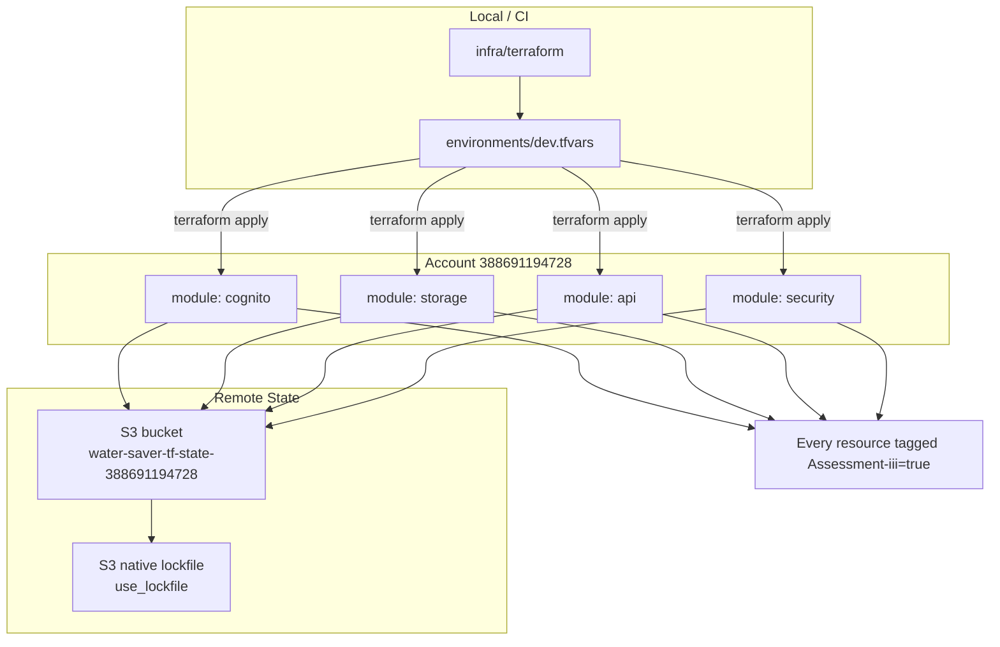
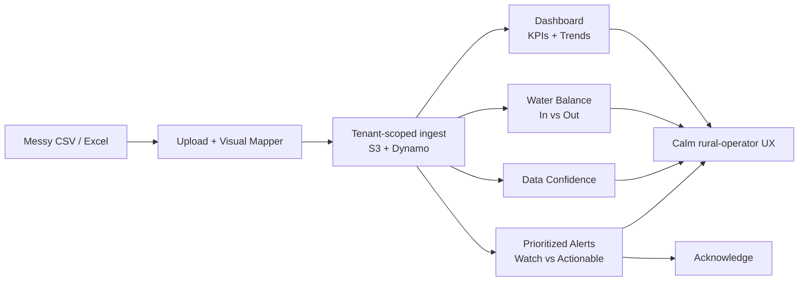
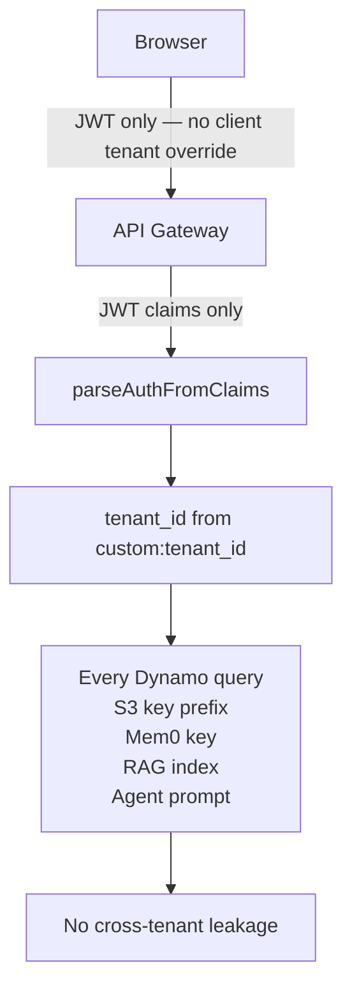

# Assessment III — Demo diagrams

Paste-ready Mermaid for the grading sheet + AWS product talk-track. Sources live beside this file as `01`–`08` `.mmd` files.

**Suggested live order:** 1 → 2 → 3 → 4 → 5 → 6 → close with 7. Show 8 once when you hit isolation.

| #   | Rubric / topic                 | Source                                                                   |
| --- | ------------------------------ | ------------------------------------------------------------------------ |
| 1   | AWS product flow               | [`01-aws-product-flow.mmd`](./01-aws-product-flow.mmd)                   |
| 2   | GitHub Actions + Compose (30%) | [`02-github-actions-compose.mmd`](./02-github-actions-compose.mmd)       |
| 3   | LangChain + Mem0 RAG (25%)     | [`03-langchain-mem0-rag.mmd`](./03-langchain-mem0-rag.mmd)               |
| 4   | LangGraph / Agent / LangSmith  | [`04-langgraph-agent-langsmith.mmd`](./04-langgraph-agent-langsmith.mmd) |
| 5   | Integrations + UI (15%)        | [`05-integrations-ui.mmd`](./05-integrations-ui.mmd)                     |
| 6   | Terraform (10%)                | [`06-terraform.mmd`](./06-terraform.mmd)                                 |
| 7   | Product happy path             | [`07-product-happy-path.mmd`](./07-product-happy-path.mmd)               |
| 8   | Tenant isolation               | [`08-tenant-isolation.mmd`](./08-tenant-isolation.mmd)                   |

Related (older / alternate): [`assessment-iii-system-architecture.mmd`](./assessment-iii-system-architecture.mmd), [`assessment-iii-data-flow.mmd`](./assessment-iii-data-flow.mmd).

---

## 1. AWS Product Flow (main architecture)

---

## 2. GitHub Actions + Docker Compose (30%)

---

## 3. LangChain + Mem0 RAG Flow (25%)

---

## 4. LangGraph / Agent / LangSmith Bonus

---

## 5. Integrations + UI (15%)

---

## 6. Terraform (10%)

Remote state uses S3 + native lockfile (`use_lockfile`), not DynamoDB.

---

## 7. Product Happy Path

---

## 8. Tenant Isolation (cross-cutting)

