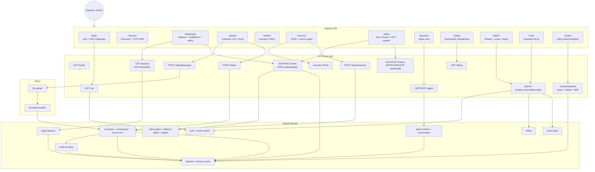
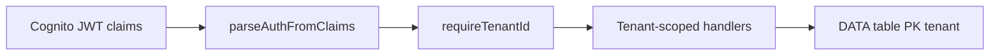
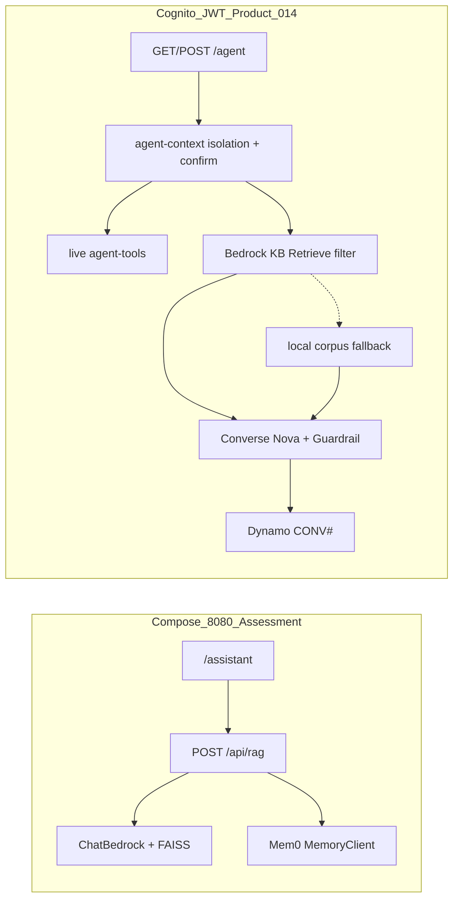

# Water Saver Function Tree (Visual Overview)

**Auto-generated raw data:** [function-inventory.generated.md](./function-inventory.generated.md) (TS scanner — `frontend/src` + `backend/src`; run `npm run inventory`)
**Status overlay:** [action-items.md](./action-items.md)
**Last scan:** 2026-08-04 — **206** tracked · **182** with proof · **24** without (scanner)

## Cross-cutting

## AI / agent

Assessment Features **001 / 007 / 008** prove Compose LangChain RAG. Feature **014** is the Cognito product path (KB + tools + CONV#).

See [action-items.md](./action-items.md) · [PROVE_FEATURES.md](./PROVE_FEATURES.md) · [evidence/014-cognito-rag-assistant.md](../evidence/014-cognito-rag-assistant.md).
