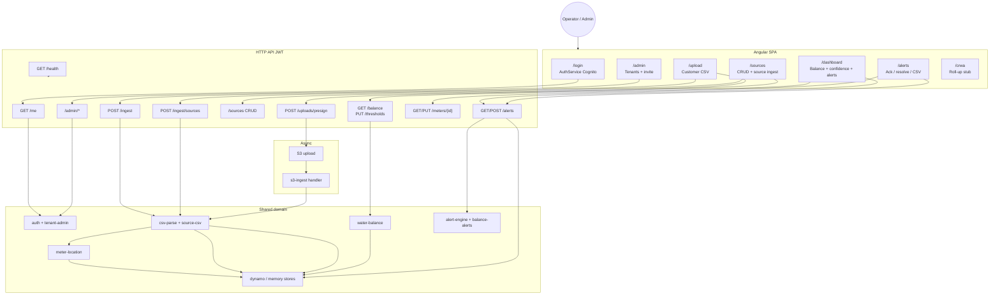
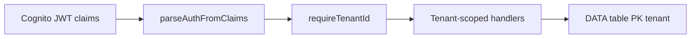
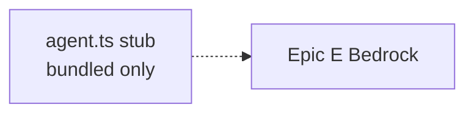

# Water Saver Function Tree (Visual Overview)

**Auto-generated raw data:** [function-inventory.generated.md](./function-inventory.generated.md) (C# scanner — currently empty for this repo)
**Status overlay:** [action-items.md](./action-items.md)

## Cross-cutting

## AI / agent (deferred)

See [action-items.md](./action-items.md) for proof status per function.
