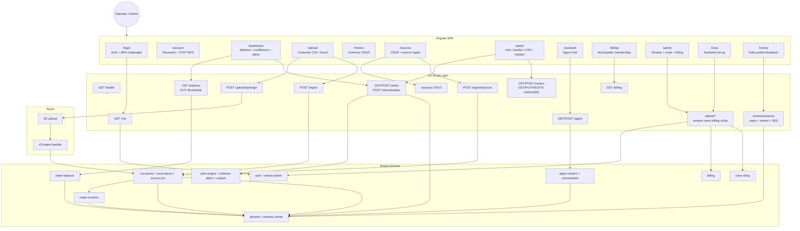
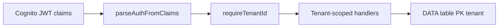
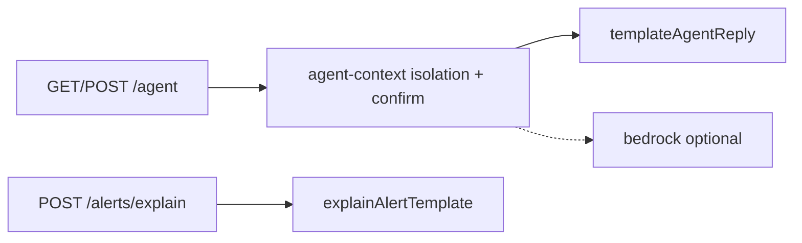

# Water Saver Function Tree (Visual Overview)

**Auto-generated raw data:** [function-inventory.generated.md](./function-inventory.generated.md) (TS scanner — `frontend/src` + `backend/src`; run `npm run inventory`)
**Status overlay:** [action-items.md](./action-items.md)

## Cross-cutting

## AI / agent

See [action-items.md](./action-items.md) for proof status per function.
